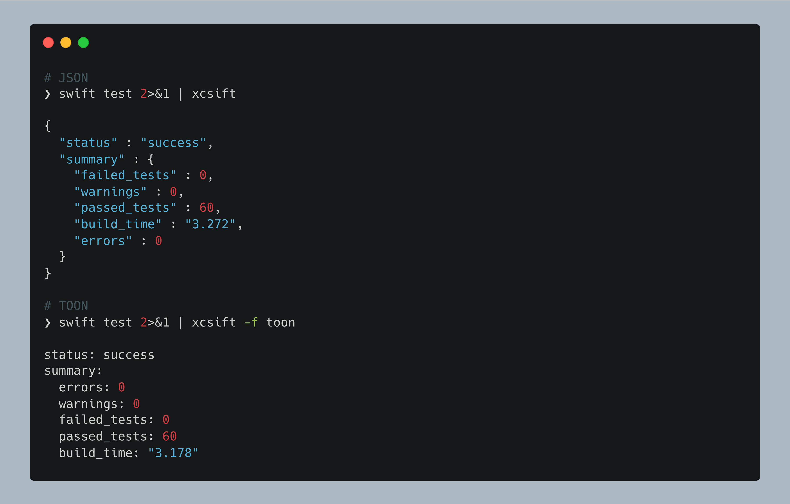

# xcsift

[](https://github.com/ldomaradzki/xcsift)
[](https://swiftpackageindex.com/ldomaradzki/xcsift)
[](https://swiftpackageindex.com/ldomaradzki/xcsift)
[](https://github.com/ldomaradzki/xcsift/actions/workflows/ci.yml)
[](https://github.com/ldomaradzki/xcsift/actions/workflows/release.yml)
[](https://ldomaradzki.github.io/xcsift/documentation/xcsift)
[](LICENSE.md)



A Swift command-line tool to parse and format xcodebuild/SPM output for coding agents, optimized for token efficiency.

## Overview

`xcsift` is designed to process verbose Xcode build output and transform it into a concise, structured format that coding agents can efficiently parse and act upon. Unlike `xcbeautify` and `xcpretty` which focus on human-readable output, `xcsift` prioritizes information density and machine readability.

## Features

- **Multiple output formats** - JSON (default), TOON (30-60% fewer tokens), or GitHub Actions
- **TOON format support** - Token-Oriented Object Notation optimized for LLM consumption
- **GitHub Actions integration** - Auto-detected workflow commands with inline PR annotations
- **Structured error reporting** - Clear categorization of errors, warnings, and test failures
- **Linker error parsing** - Captures undefined symbols, missing frameworks/libraries, architecture mismatches, and duplicate symbols with conflicting file paths
- **File/line number extraction** - Easy navigation to problematic code locations
- **Build status summary** - Quick overview of build results
- **Automatic code coverage conversion** - Converts .profraw (SPM) and .xcresult (xcodebuild) to JSON automatically
- **Target filtering** - Automatically filters xcodebuild coverage to tested target only
- **Summary-only mode** - Default coverage output includes only percentage (token-efficient)
- **Quiet mode** - Suppress output when build succeeds with no warnings or errors
- **Werror mode** - Treat warnings as errors (build fails if warnings present)
- **Build info** - Per-target phases and timing (CompileSwiftSources, Link, etc. with per-target duration)

## Installation

### Option 1: Homebrew (Recommended)

```bash
# Install from custom tap
brew tap ldomaradzki/xcsift
brew install xcsift

# Or install directly from formula
brew install https://raw.githubusercontent.com/ldomaradzki/xcsift/master/homebrew-formula/xcsift.rb
```

### Option 2: Mint

If you use [Mint](https://github.com/yonaskolb/mint) for managing Swift command-line tools:

```bash
mint install ldomaradzki/xcsift
```

### Option 3: mise

If you use [mise](https://mise.jdx.dev/) for managing development tools:

```bash
# Install from mise registry
mise use -g xcsift

# Or add to your .mise.toml
# [tools]
# xcsift = "latest"
```

This will automatically download the latest binary from GitHub releases.

### Option 4: Build from Source

```bash
git clone https://github.com/ldomaradzki/xcsift.git
cd xcsift
swift build -c release
cp .build/release/xcsift /usr/local/bin/
```

## Usage

Pipe xcodebuild output directly to xcsift:

```bash
xcodebuild [flags] 2>&1 | xcsift
```

**Important**: Always use `2>&1` to redirect stderr to stdout. This ensures all compiler errors, warnings, and build output are captured, removing noise and providing clean, structured output.

Supports **JSON** (default), **TOON**, and **GitHub Actions** formats.

### Examples

```bash
# Basic usage with JSON output (warning count shown in summary only)
xcodebuild build 2>&1 | xcsift

# Print detailed warnings list (useful for fixing warnings)
xcodebuild build 2>&1 | xcsift --warnings
xcodebuild build 2>&1 | xcsift -w

# Quiet mode - suppress output when build succeeds with no warnings or errors
xcodebuild build 2>&1 | xcsift --quiet
swift build 2>&1 | xcsift -q

# Werror mode - treat warnings as errors (build fails if warnings present)
xcodebuild build 2>&1 | xcsift --Werror
swift build 2>&1 | xcsift -W

# Code coverage - automatic conversion from .profraw or .xcresult to JSON
# Default: summary-only mode (line coverage percentage only - token-efficient)
# xcodebuild automatically searches ~/Library/Developer/Xcode/DerivedData for latest .xcresult
# and filters to tested target only
swift test --enable-code-coverage 2>&1 | xcsift --coverage
xcodebuild test -enableCodeCoverage YES 2>&1 | xcsift --coverage
xcodebuild test 2>&1 | xcsift -c

# Show detailed per-file coverage (use when you need file-by-file breakdown)
swift test --enable-code-coverage 2>&1 | xcsift --coverage --coverage-details
xcodebuild test 2>&1 | xcsift -c --coverage-details

# Specify custom coverage path (optional - auto-detects by default)
swift test --enable-code-coverage 2>&1 | xcsift --coverage --coverage-path .build/arm64-apple-macosx/debug/codecov

# Test output parsing
xcodebuild test 2>&1 | xcsift

# Swift Package Manager support
swift build 2>&1 | xcsift
swift test 2>&1 | xcsift

# TOON format (30-60% fewer tokens for LLMs)
# Token-Oriented Object Notation - optimized for reducing LLM API costs
xcodebuild build 2>&1 | xcsift --format toon
xcodebuild build 2>&1 | xcsift -f toon

# TOON with warnings
swift build 2>&1 | xcsift -f toon --warnings
xcodebuild build 2>&1 | xcsift -f toon -w

# TOON with coverage
swift test --enable-code-coverage 2>&1 | xcsift -f toon --coverage
xcodebuild test -enableCodeCoverage YES 2>&1 | xcsift -f toon -c

# Combine all flags
xcodebuild test 2>&1 | xcsift -f toon -w -c --coverage-details

# TOON key folding - collapse nested objects to dotted paths
xcodebuild build 2>&1 | xcsift -f toon --toon-key-folding safe
swift build 2>&1 | xcsift -f toon --toon-key-folding safe --toon-flatten-depth 3

# Build info - show per-target phases and timing (xcodebuild only)
xcodebuild build 2>&1 | xcsift --build-info
xcodebuild build 2>&1 | xcsift -f toon --build-info -w

# GitHub Actions format (auto-detected when GITHUB_ACTIONS=true)
# Creates workflow annotations visible in PR and Actions UI
xcodebuild build 2>&1 | xcsift --format github-actions
swift test 2>&1 | xcsift -f github-actions -w

# Manual override in CI (auto-detected by default)
xcodebuild build 2>&1 | xcsift -f github-actions
```

## Output Format

### JSON Format

#### Test failures with coverage

```json
{
  "status": "failed",
  "summary": {
    "errors": 1,
    "warnings": 1,
    "failed_tests": 2,
    "linker_errors": 0,
    "passed_tests": 28,
    "build_time": "3.2",
    "coverage_percent": 85.5
  },
  "errors": [
    {
      "file": "main.swift",
      "line": 15,
      "message": "use of undeclared identifier 'unknown'"
    }
  ],
  "warnings": [
    {
      "file": "ViewController.swift",
      "line": 23,
      "message": "variable 'temp' was never used; consider removing it"
    }
  ],
  "failed_tests": [
    {
      "test": "Test assertion",
      "message": "XCTAssertEqual failed: (\"invalid\") is not equal to (\"valid\")"
    }
  ],
  "coverage": {
    "line_coverage": 85.5,
    "files": [
      {
        "path": "/path/to/ViewController.swift",
        "name": "ViewController.swift",
        "line_coverage": 92.5,
        "covered_lines": 37,
        "executable_lines": 40
      }
    ]
  }
}
```

#### Linker errors - undefined symbols

```json
{
  "status": "failed",
  "summary": {
    "errors": 0,
    "warnings": 0,
    "failed_tests": 0,
    "linker_errors": 1
  },
  "linker_errors": [
    {
      "symbol": "_OBJC_CLASS_$_MissingClass",
      "architecture": "arm64",
      "referenced_from": "ViewController.o",
      "message": "",
      "conflicting_files": []
    }
  ]
}
```

#### Linker errors - duplicate symbols

```json
{
  "status": "failed",
  "summary": {
    "errors": 0,
    "warnings": 0,
    "failed_tests": 0,
    "linker_errors": 1
  },
  "linker_errors": [
    {
      "symbol": "_globalConfiguration",
      "architecture": "arm64",
      "referenced_from": "",
      "message": "",
      "conflicting_files": [
        "/path/to/ConfigA.o",
        "/path/to/ConfigB.o"
      ]
    }
  ]
}
```

**Note on warnings:** By default, only the warning count appears in `summary.warnings`. The detailed `warnings` array (shown above) is only included when using the `--warnings` flag. This reduces token usage for coding agents that don't need to process every warning.

**Note on linker errors:** The `linker_errors` array is automatically included when linker errors are detected. Supported error types:
- Undefined symbols (missing classes, functions, variables) - uses `referenced_from` field
- Missing frameworks (`ld: framework not found`)
- Missing libraries (`ld: library not found for -l`)
- Architecture mismatches (`building for iOS Simulator, but linking in dylib built for iOS`)
- Duplicate symbols - uses `conflicting_files` array to show which object files contain the duplicate

**Note on coverage:** The `coverage` section is only included when using the `--coverage-details` flag:
- **Summary-only mode** (default): Only includes coverage percentage in summary for maximum token efficiency
  ```json
  {
    "summary": {
      "coverage_percent": 85.5
    }
  }
  ```
- **Details mode** (with `--coverage-details`): Includes full `files` array as shown in the example above
- **Target filtering** (xcodebuild only): Automatically extracts tested target from stdout and shows coverage for that target only
- xcsift automatically converts `.profraw` files (SPM) or `.xcresult` bundles (xcodebuild) to JSON format without requiring manual llvm-cov or xccov commands

**Note on build info:** The `build_info` section is only included when using the `--build-info` flag:
```json
{
  "build_info": {
    "targets": [
      {
        "name": "MyFramework",
        "duration": "12.4s",
        "phases": ["CompileSwiftSources", "Link"]
      },
      {
        "name": "MyApp",
        "duration": "23.1s",
        "phases": ["CompileSwiftSources", "Link", "CopySwiftLibs"]
      }
    ]
  }
}
```
- Groups phases by target with per-target timing
- Total build time is always in `summary.build_time` (not duplicated in build_info)
- Parses xcodebuild timing from "Build target X (Ys)" patterns
- Supports: `CompileSwiftSources`, `SwiftCompilation`, `CompileC`, `Link`, `CopySwiftLibs`, `PhaseScriptExecution`, `LinkAssetCatalog`, `ProcessInfoPlistFile`
- Empty fields are omitted (targets without phases won't have `phases` field)

### TOON Format

With the `--format toon` / `-f toon` flag, xcsift outputs in **TOON (Token-Oriented Object Notation)** format, which provides **30-60% token reduction** compared to JSON. This format is specifically optimized for LLM consumption and can significantly reduce API costs.

#### Compiler errors and warnings

```toon
status: failed
summary:
  errors: 1
  warnings: 3
  failed_tests: 0
  linker_errors: 0
errors[1]{file,line,message}:
  main.swift,15,"use of undeclared identifier \"unknown\""
warnings[3]{file,line,message}:
  Parser.swift,20,"immutable value \"result\" was never used"
  Parser.swift,25,"variable \"foo\" was never mutated"
  Model.swift,30,"initialization of immutable value \"bar\" was never used"
```

#### Linker errors

```toon
status: failed
summary:
  errors: 0
  warnings: 0
  failed_tests: 0
  linker_errors: 1
linker_errors[1]{symbol,architecture,referenced_from,message}:
  "_OBJC_CLASS_$_MissingClass","arm64","ViewController.o",""
```

**TOON Benefits:**
- **30-60% fewer tokens** - Reduces LLM API costs significantly
- **Tabular format** - Uniform arrays (errors, warnings) shown as compact tables
- **Human-readable** - Indentation-based structure similar to YAML
- **Compatible** - Works with all existing flags (`--quiet`, `--coverage`, `--warnings`)

**Example token savings:**
- Same build output (1 error, 3 warnings)
- JSON: 652 bytes
- TOON: 447 bytes
- **Savings: 31.4%** (205 bytes)

### TOON Configuration

TOON format can be customized with delimiter options for different use cases:

**Delimiter Options** (`--toon-delimiter [comma|tab|pipe]`):
- `comma` (default): CSV-style format, most compact
  ```bash
  xcodebuild build 2>&1 | xcsift -f toon
  # Output: errors[1]{file,line,message}:
  #   main.swift,15,"use of undeclared identifier"
  ```

- `tab`: TSV-style format, ideal for Excel/spreadsheet import
  ```bash
  xcodebuild build 2>&1 | xcsift -f toon --toon-delimiter tab
  # Output uses tabs instead of commas, can be directly imported to Excel
  ```

- `pipe`: Alternative separator, useful when data contains many commas
  ```bash
  xcodebuild build 2>&1 | xcsift -f toon --toon-delimiter pipe
  # Output: errors[1]{file|line|message}:
  #   main.swift|15|"use of undeclared identifier"
  ```

### TOON Key Folding

Key folding collapses nested single-key objects into dotted paths for more compact output.

**Key Folding Options** (`--toon-key-folding [disabled|safe]`):
- `disabled` (default): Normal nested output
  ```toon
  summary:
    errors: 1
    warnings: 0
  ```

- `safe`: Collapses nested single-key objects to dotted paths
  ```bash
  xcodebuild build 2>&1 | xcsift -f toon --toon-key-folding safe
  # Transforms {a:{b:{c:1}}} → a.b.c: 1 when all keys are valid identifiers
  ```

**Flatten Depth** (`--toon-flatten-depth N`):
- Limits how deep key folding goes (default: unlimited)
  ```bash
  # Limit folding to 3 levels deep
  xcodebuild build 2>&1 | xcsift -f toon --toon-key-folding safe --toon-flatten-depth 3

  # Limit folding to 2 levels deep
  swift build 2>&1 | xcsift -f toon --toon-key-folding safe --toon-flatten-depth 2
  ```

**Combined TOON Configuration:**
```bash
# All TOON options together
xcodebuild test 2>&1 | xcsift -f toon --toon-delimiter pipe --toon-key-folding safe --toon-flatten-depth 5 -w -c
```

### GitHub Actions Format (Auto-Appended on CI)

On GitHub Actions (when `GITHUB_ACTIONS=true`), xcsift **automatically appends** workflow annotations after the JSON/TOON output. This creates inline annotations in pull requests and workflow runs **while preserving structured output**.

**Behavior Matrix:**

| Environment | Format Flag | Output |
|-------------|-------------|--------|
| Local | (none) | JSON |
| Local | `-f toon` | TOON |
| Local | `-f github-actions` | Annotations only |
| **CI** | **(none)** | **JSON + Annotations** |
| **CI** | **`-f toon`** | **TOON + Annotations** |
| CI | `-f github-actions` | Annotations only |

**Example CI Output:**
```
{
  "status": "failed",
  "summary": { "errors": 1, "warnings": 1 }
}
::error file=main.swift,line=15,col=5::use of undeclared identifier 'unknown'
::warning file=Parser.swift,line=20,col=10::immutable value 'result' was never used
::notice ::Build failed, 1 error, 1 warning
```

**Features:**
- **Dual output on CI** - JSON/TOON for tools + annotations for GitHub UI
- **Inline PR annotations** - Errors and warnings appear directly on the relevant file and line
- **Aggregated summary** - All issues visible in the workflow run's Annotations tab
- **Zero configuration** - Works automatically in GitHub Actions
- **File/line/column** - Precise location information for quick navigation
- **Compatible flags** - Works with `--warnings`, `--coverage`, `--quiet`

**GitHub Actions Workflow Example:**
```yaml
name: Build

on: [push, pull_request]

jobs:
  build:
    runs-on: macos-latest
    steps:
      - uses: actions/checkout@v4
      - name: Build
        run: |
          set -o pipefail
          xcodebuild build 2>&1 | xcsift
          # Outputs JSON + annotations automatically on CI

      - name: Build with TOON
        run: |
          set -o pipefail
          xcodebuild build 2>&1 | xcsift -f toon
          # Outputs TOON + annotations automatically on CI

      - name: Annotations only (no structured output)
        run: |
          set -o pipefail
          xcodebuild build 2>&1 | xcsift -f github-actions
```

**Annotation Types:**
- `::error file=X,line=Y,col=Z::message` - Compile errors, test failures
- `::warning file=X,line=Y,col=Z::message` - Compiler warnings
- `::notice ::summary` - Build summary with status, counts, coverage

## Comparison with xcbeautify/xcpretty

| Feature | xcsift | xcbeautify | xcpretty |
|---------|---------|------------|----------|
| **Target audience** | Coding agents / LLMs / CI | Humans / CI | Humans |
| **Output format** | JSON + TOON + GH Actions | Colorized text + GH Actions | Formatted text |
| **Token efficiency** | Very High (TOON) | Medium | Low |
| **LLM optimization** | Yes (TOON format) | No | No |
| **Machine readable** | Yes | No | Limited |
| **GitHub Actions** | Yes (auto-detected) | Yes | No |
| **Error extraction** | Structured | Visual | Visual |
| **Linker errors** | Yes (structured) | No | No |
| **Code coverage** | Auto-converts | No | No |
| **Build time** | Fast | Fast | Slower |

## Platform Support

- **macOS 15+**: Full support including code coverage
- **Linux (Swift 6.0+)**: Build/test parsing supported; coverage features unavailable

## Development

### Building

```bash
swift build
swift build -c release
```

### Running Tests

```bash
swift test
```

### Formatting

**Required before committing:**

```bash
swift format --recursive --in-place .
```

### Documentation

Generate DocC documentation locally:

```bash
# Build static documentation
swift package --allow-writing-to-directory docs \
    generate-documentation --target xcsift \
    --disable-indexing \
    --transform-for-static-hosting \
    --hosting-base-path xcsift \
    --output-path docs

# Preview documentation (opens in browser at http://localhost:8080)
swift package --disable-sandbox preview-documentation --target xcsift
```

Documentation source files are in `Sources/xcsift.docc/`:
- `xcsift.md` — Main overview
- `GettingStarted.md` — Installation guide
- `Usage.md` — CLI reference
- `OutputFormats.md` — Format details
- `CodeCoverage.md` — Coverage feature

**Production URL:** [ldomaradzki.github.io/xcsift](https://ldomaradzki.github.io/xcsift/documentation/xcsift)

## License

MIT License
