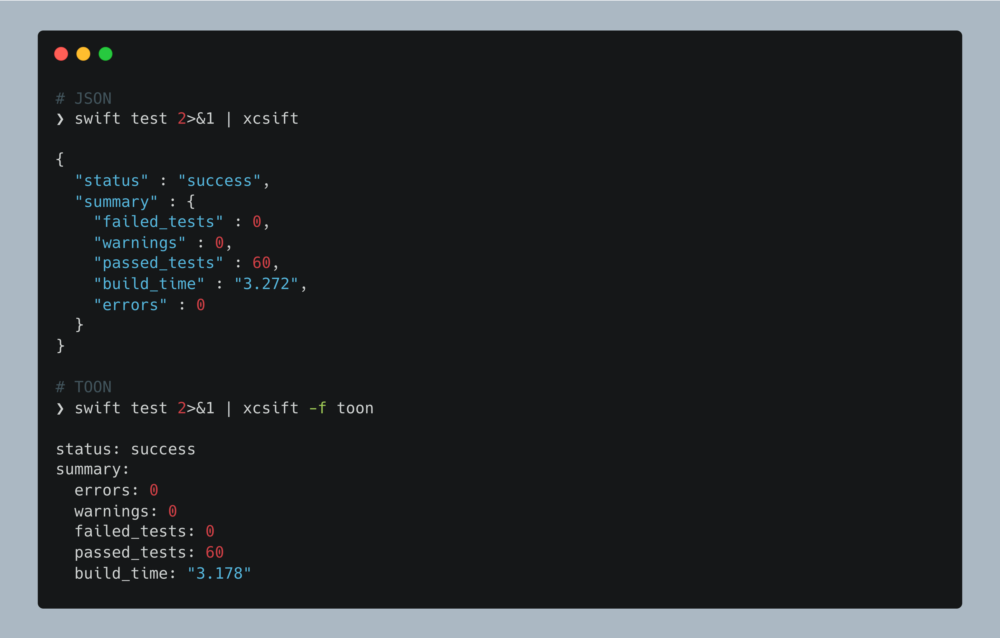

# xcsift

[](https://github.com/ldomaradzki/xcsift)
[](https://swiftpackageindex.com/ldomaradzki/xcsift)
[](https://swiftpackageindex.com/ldomaradzki/xcsift)
[](https://github.com/ldomaradzki/xcsift/actions/workflows/ci.yml)
[](https://github.com/ldomaradzki/xcsift/actions/workflows/release.yml)
[](https://ldomaradzki.github.io/xcsift/documentation/xcsift)
[](LICENSE.md)



A Swift command-line tool to parse and format xcodebuild/SPM output for coding agents, optimized for token efficiency.

## Overview

`xcsift` transforms verbose Xcode build output into concise, structured formats that coding agents and LLMs can efficiently parse and act upon. Unlike `xcbeautify` and `xcpretty` which focus on human-readable output, `xcsift` prioritizes information density and machine readability.

## Features

- **Multiple output formats** — JSON (default), TOON (30-60% fewer tokens), GitHub Actions
- **Structured error reporting** — errors, warnings, linker errors, test failures with file/line locations
- **Automatic code coverage** — converts `.profraw` (SPM) and `.xcresult` (xcodebuild) to JSON
- **Build info** — per-target phases, timing, dependencies, and slowest targets
- **Test analysis** — slow test detection, flaky test detection, duration tracking
- **GitHub Actions integration** — auto-detected workflow annotations with inline PR comments
- **Configuration files** — `.xcsift.toml` for project or user-wide defaults
- **Quiet/Werror/exit-on-failure modes** — for CI pipelines
- **xcbeautify/Tuist input** — parse pre-formatted output with `--xcbeautify`

See the [full documentation](https://ldomaradzki.github.io/xcsift/documentation/xcsift) for details.

## Installation

### Homebrew (Recommended)

```bash
brew install xcsift
```

### Build from Source

```bash
git clone https://github.com/ldomaradzki/xcsift.git
cd xcsift
swift build -c release
cp .build/release/xcsift /usr/local/bin/
```

Also available via [mise](https://ldomaradzki.github.io/xcsift/documentation/xcsift/gettingstarted) and [Mint](https://ldomaradzki.github.io/xcsift/documentation/xcsift/gettingstarted).

## Plugin Installation

Integrate with coding assistants via built-in installers:

| Assistant | Install | Uninstall |
|-----------|---------|-----------|
| Claude Code | `xcsift install-claude-code` | `xcsift uninstall-claude-code` |
| Codex | `xcsift install-codex` | `xcsift uninstall-codex` |
| Cursor | `xcsift install-cursor` | `xcsift uninstall-cursor` |

See [Plugin Installation](https://ldomaradzki.github.io/xcsift/documentation/xcsift/plugininstallation) for options and verification steps.

## Quick Start

Pipe any xcodebuild or SPM command through xcsift. Always use `2>&1` to capture stderr.

```bash
# Build
xcodebuild build 2>&1 | xcsift
swift build 2>&1 | xcsift

# Test with coverage
swift test --enable-code-coverage 2>&1 | xcsift --coverage
xcodebuild test -enableCodeCoverage YES 2>&1 | xcsift -c --coverage-details

# TOON format (30-60% fewer tokens)
xcodebuild build 2>&1 | xcsift -f toon -w

# Warnings as errors + exit on failure (CI)
xcodebuild build 2>&1 | xcsift --Werror --exit-on-failure

# Configuration file
xcsift --init                    # Generate .xcsift.toml template
```

See [Usage](https://ldomaradzki.github.io/xcsift/documentation/xcsift/usage) for the full CLI reference, [Output Formats](https://ldomaradzki.github.io/xcsift/documentation/xcsift/outputformats) for JSON/TOON/GitHub Actions details, and [Configuration](https://ldomaradzki.github.io/xcsift/documentation/xcsift/configuration) for config file options.

## Comparison with xcbeautify/xcpretty

| Feature | xcsift | xcbeautify | xcpretty |
|---------|---------|------------|----------|
| **Target audience** | Coding agents / LLMs / CI | Humans / CI | Humans |
| **Output format** | JSON + TOON + GH Actions | Colorized text + GH Actions | Formatted text |
| **Token efficiency** | Very High (TOON) | Medium | Low |
| **LLM optimization** | Yes (TOON format) | No | No |
| **Machine readable** | Yes | No | Limited |
| **GitHub Actions** | Yes (auto-detected) | Yes | No |
| **Error extraction** | Structured | Visual | Visual |
| **Linker errors** | Yes (structured) | No | No |
| **Code coverage** | Auto-converts | No | No |
| **Build time** | Fast | Fast | Slower |

## Platform Support

- **macOS 15+**: Full support including code coverage
- **Linux (Swift 6.0+)**: Build/test parsing supported; coverage features unavailable

## Development

```bash
swift build                            # Build
swift test                             # Run tests
swift format --recursive --in-place .  # Format (required before committing)
```

Documentation source is in `Sources/xcsift.docc/`. Preview locally:

```bash
swift package --disable-sandbox preview-documentation --target xcsift
```

**Hosted docs:** [ldomaradzki.github.io/xcsift](https://ldomaradzki.github.io/xcsift/documentation/xcsift)

## License

MIT License
